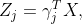

## Short report on income inequality using LASSO and PCA

# 1 Introduction

Brazil, one of the largest emerging economies in the world, has been
recently successful in decreasing income inequality because of
consolidated democracy, a stable macroeconomic environment, and the
adoption of several government anti-poverty incentives. But despite
taking millions of people out of the poverty, Brazil still faces a huge
income gap between the country’s richest and the rest of the population.
For example, between 2001 and 2015, more than 50% of economic growth was
accounted by the richest 10%. The riches will benefit more from the
economic stability that leads relatively to a higher income inequality
(Oxfam 2021). To improve our understanding of which factors influence
income inequality and how this evolves in response to policy changes,
this research attempts to predict and characterize determinants of
income inequality. Therefore, the research questions is: *What are the
characteristics that explain the income inequality ratio in Brazil, and
how can this be predicted?*

# 2 Data

The provided data is from the last Brazilian National Census (2010). It
contains 4500 observations and 30 variables from Brazilian cities in 26
states plus a federal district. The data consists of mainly percentage
variables, except for income, population, average number of children,
and numerical and categorical indicators for municipalities and states.
For this research, the variables UF, CODMUN6, and NOMEMUN, which
indicate the state code, municipality code, and municipality name,
respectively, are removed. Moreover, the variable of interest R1040,
which indicate the ratio of 10% richest divided by the 40% poorest
(10/40 ratio), and RPDC, which is the per capita income, are transformed
to its natural logarithm to make them normally distributed.
Additionally, a new variable, Region, indicating which region the
observation belongs to is added. The resulting data set contains 28
variables.

# 3 Methodology

To investigate characteristics and predict the income inequality ratio,
two models are constructed. First, a penalized regression using Least
Absolute Shrinkage and Selection Operator (LASSO). Second, a linear
regression using Principal Component Analysis (PCA) scores. The data is
randomly divided into training, test and prediction sets of 3592, 898,
and 10 observations, respectively. For PCA, the the state and region
variables are excluded as PCA is designed for continuous variables.

LASSO regression punishes variables by introducing a penalty term,
unimportant coefficients are in this way shrunk to zero. Hence, variable
selection is performed and multicollinearity is dealt with by this
technique. A L1 penalty to the residual sum of squares is added by LASSO
regression. It minimizes the following:

where *i* = 1,2, …, *n*, *j* = 1,2, …, *p*, *n* = 3592, *p* = 27,
*y**i* the values of the 10/40 ratio, and *X* the matrix of
predictor variables. This is identical to minimizing the sum of squares
with constraint $\\sum\_{j=1}^{p}\\left\|\\beta\_{j}\\right\| \\leq s$
for *s* \> 0. The optimal value of *λ* is chosen using 10-fold cross
validation and corresponds to the smallest in-sample root mean square
error (RMSE).

As datasets grow larger, the complexity of such datasets increases. In
order to derive actionable insights from large datasets, methods are
required to drastically reduce their dimensionality in an interpretable
way (Jolliffe and Cadima 2016). PCA is a technique for reducing the
dimensionality, while simultaneously minimizing information loss. It
does so by creating new orthogonal variables named principal components.
Each component is a linear combination the original variables:

 

where *Z**j* are the principal components, *γ**j*
the loading vectors. Finding each component means finding the
corresponding loading vector of each component with constraint that
their sum of squares is equal to 1. The computation continues until a
total of *p* principal components have been calculated, which in this
case equals 25. The importance of a principal component is given by its
eigenvalue *λ**j* = Var (*Z**j*), and are ordered
such that the first component accounts for the greatest possible
variance in the data set, the second component accounts for the next
highest variance and so on. In order to select how many principal
components should enter the model, a scree plot is analyzed for an
“elbow,” and permutation tests, based on 100 replications, is performed
to test the significance of eigenvalues. Moreover, bootstrap is repeated
1000 times and applied to the Kaiser’s rule to test whether the
eigenvalues of principal components are greater than 1.

# 4 Results

Figure 1: Coefficient path LASSO

Figure 1 shows the coefficient path of the LASSO regression model. The
important positive predictors for this model are RDPC, T_NESTUD, and
RAZDEP, which correspond to; Per capita income, Percentage of people
(15-24 years old) that do not study or work and are vulnerable to
poverty, and Dependence ratio, respectively. The important negative
predictors are PRENTRAB, MORT1, and ESPVIDA, which correspond to;
Percentage of labor income, Infant mortality, and Life expectancy when
born, respectively. The optimal value of *λ* that has been found is
equal to 0.00025, which suggest a very low level of shrinkage of the
coefficients by LASSO.

For PCA, after analyzing the screeplot of the principal components using
the “elbow” rule, it is not clear whether three or four components
should be selected. Permutation tests indicate that components one to
four are significant at the 5% level. In addition, the bootstrap
procedure indicates that the eigenvalues of components one to four are
greater than 1 at the 5% significance level. Therefore, the first four
principal components are selected for the PCA regression model. The
cumulative variance explained by these four components is approximately
70%.

Figure 2 shows the biplot of the PCA. It can be noticed that the first
principal component shows relatively high loadings for variables related
to income and education. The second component is highly related to
demographics and urbanization. Also, from the regional clustered scores
in the biplot, it can be observed that the northern part of Brazil has
lower values for income and education in comparison to the southern
part. In addition, principal components 3 and 4, which are not
visualized, show relatively high loadings for variables related to
quality of housing and employment, respectively.

Figure 2: Biplot of PCA

To evaluate the models on their precision, predictions of the 10/40
ratio are made using the built models and observations from the test
set. The predicted values are back-transformed for evaluation. Table 1
shows the RMSE of the predictions. LASSO performs better than PCA in
both in-sample and out-of-sample predictions. Predictions made on the
test set using the LASSO model is off on average by 7.11 percentage
points, in comparison to 7.41 percentage points by the PCA model.
Finally, predictions of the 10/40 ratio are made for 10 municipalities.
Table 2 displays the results.

<table class="table" style="margin-left: auto; margin-right: auto;">
<caption>
Table 1: RMSE Comparison of LASSO and PCA
</caption>
<thead>
<tr>
<th style="text-align:right;">
LASSO Train
</th>
<th style="text-align:right;">
LASSO Test
</th>
<th style="text-align:right;">
PCA Train
</th>
<th style="text-align:right;">
PCA Test
</th>
</tr>
</thead>
<tbody>
<tr>
<td style="text-align:right;">
5.161535
</td>
<td style="text-align:right;">
7.109838
</td>
<td style="text-align:right;">
6.514746
</td>
<td style="text-align:right;">
7.412083
</td>
</tr>
</tbody>
</table>
<table class="table" style="margin-left: auto; margin-right: auto;">
<caption>
Table 2: Inequality ratio prediction for 10 municipalities
</caption>
<thead>
<tr>
<th style="text-align:left;">
</th>
<th style="text-align:right;">
LASSO
</th>
<th style="text-align:right;">
PCA
</th>
<th style="text-align:right;">
Actual
</th>
</tr>
</thead>
<tbody>
<tr>
<td style="text-align:left;">
3958
</td>
<td style="text-align:right;">
7.78
</td>
<td style="text-align:right;">
10.40
</td>
<td style="text-align:right;">
7.60
</td>
</tr>
<tr>
<td style="text-align:left;">
2815
</td>
<td style="text-align:right;">
9.58
</td>
<td style="text-align:right;">
9.83
</td>
<td style="text-align:right;">
7.67
</td>
</tr>
<tr>
<td style="text-align:left;">
3625
</td>
<td style="text-align:right;">
9.18
</td>
<td style="text-align:right;">
10.80
</td>
<td style="text-align:right;">
10.78
</td>
</tr>
<tr>
<td style="text-align:left;">
1756
</td>
<td style="text-align:right;">
11.49
</td>
<td style="text-align:right;">
11.49
</td>
<td style="text-align:right;">
11.20
</td>
</tr>
<tr>
<td style="text-align:left;">
3580
</td>
<td style="text-align:right;">
9.52
</td>
<td style="text-align:right;">
11.08
</td>
<td style="text-align:right;">
11.31
</td>
</tr>
<tr>
<td style="text-align:left;">
1550
</td>
<td style="text-align:right;">
10.85
</td>
<td style="text-align:right;">
10.16
</td>
<td style="text-align:right;">
11.51
</td>
</tr>
<tr>
<td style="text-align:left;">
1637
</td>
<td style="text-align:right;">
10.29
</td>
<td style="text-align:right;">
10.05
</td>
<td style="text-align:right;">
12.27
</td>
</tr>
<tr>
<td style="text-align:left;">
941
</td>
<td style="text-align:right;">
17.53
</td>
<td style="text-align:right;">
18.16
</td>
<td style="text-align:right;">
15.45
</td>
</tr>
<tr>
<td style="text-align:left;">
2573
</td>
<td style="text-align:right;">
27.26
</td>
<td style="text-align:right;">
18.28
</td>
<td style="text-align:right;">
22.60
</td>
</tr>
<tr>
<td style="text-align:left;">
156
</td>
<td style="text-align:right;">
27.82
</td>
<td style="text-align:right;">
31.75
</td>
<td style="text-align:right;">
46.75
</td>
</tr>
</tbody>
</table>

# 5 Conclusion & Discussion

In this research, the characteristics that explain the income inequality
ratio in Brazil are analyzed and prediction models for the inequality
ratio are built using LASSO and PCA. LASSO resulted in a very low level
of shrinkage of the coefficients. The most important variables for
predictions with LASSO are; Per capita income, Percentage of people
(15-24 years old) that do not study or work and are vulnerable to
poverty, Dependence ratio, Percentage of labor income, Infant mortality,
and Life expectancy when born. Additionally, the characteristics
resulting from PCA are; income and education, demographics and
urbanization, quality of housing, and employment. Finally, in this
sample, LASSO predicts the inequality ratio more precise than PCA using
a linear regression. For further research, more and recent data might be
used to generate new insights and improve predictive accuracy.

# 6 References

Jolliffe, Ian T, and Jorge Cadima. 2016. “Principal Component Analysis:
A Review and Recent Developments.” *Philosophical Transactions of the
Royal Society A: Mathematical, Physical and Engineering Sciences* 374
(2065): 20150202.

Oxfam. 2021. “Brazil: Extreme Inequality in Numbers.” 2021.
<https://www.oxfam.org/en/brazil-extreme-inequality-numbers>.

